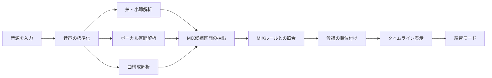
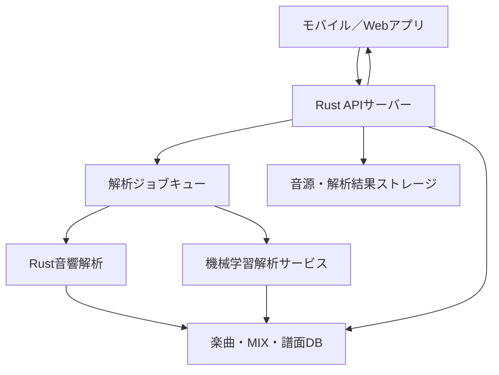
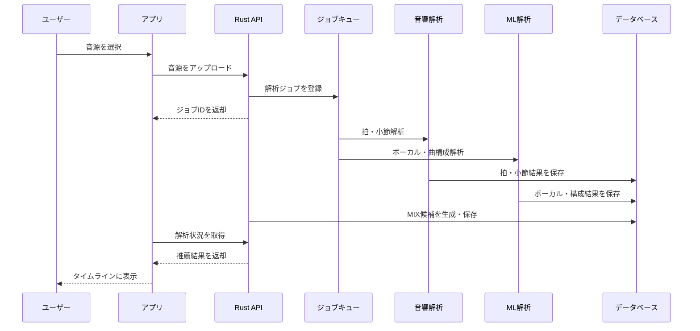

# 楽曲に合うMIXを解析・推薦するアプリの処理フロー

## 1. 目的

ユーザーから楽曲データを受け取り、以下を自動的に行う。

- 楽曲の拍・小節を解析する
- イントロや間奏などの曲構成を推定する
- ボーカルの少ない区間を検出する
- MIXを入れやすい区間を抽出する
- 区間に適したMIXを推薦する
- 楽曲と同期してMIXを練習できるようにする

> MIXの種類や実施位置には、アイドルグループ、楽曲、ライブ現場、時期などによる慣習の違いがある。そのため、解析結果は「正解」ではなく推薦候補として提示し、ユーザーが修正できる設計とする。

---

## 2. 全体フロー



---

## 3. 音源の入力

### 対応する音源

- ユーザーが所有するMP3
- WAV
- FLAC
- AAC
- ユーザー自身が録音した音源
- 権利処理されたプレビュー音源

Spotify APIから一般楽曲の音源ファイルを自由に取得することはできないため、初期版ではユーザーが音声ファイルをアップロードする方式を採用する。

### 解析ジョブの作成例

```json
{
  "track_id": "track_123",
  "audio_file": "song.mp3",
  "status": "queued"
}
```

---

## 4. 音声のデコードと標準化

入力された音源を解析しやすい形式へ変換する。

### 処理内容

1. 音声ファイルをPCMへデコードする
2. ステレオ音源をモノラル化する
3. サンプルレートを統一する
4. 音量を正規化する
5. 曲頭・曲末の無音を検出する
6. 波形表示用のピークデータを作成する

### 推奨設定

- サンプル形式：`f32`
- チャンネル：モノラル
- サンプルレート：22,050Hzまたは44,100Hz
- 振幅範囲：`-1.0〜1.0`

### Rustの候補クレート

| 用途                    | クレート    |
| ----------------------- | ----------- |
| MP3・FLACなどのデコード | `symphonia` |
| リサンプリング          | `rubato`    |
| WAV処理                 | `hound`     |
| ラウドネス測定          | `ebur128`   |

---

## 5. 拍・小節の解析

楽曲から以下の情報を推定する。

- BPM
- 各拍の開始時刻
- ダウンビート
- 小節の開始・終了時刻
- 拍子
- テンポ変化
- 解析信頼度

ダウンビートとは、小節の1拍目に当たる拍である。隣り合うダウンビート間をひとつの小節として扱う。

### 解析結果の例

```json
{
  "tempo": 164.2,
  "time_signature": 4,
  "bars": [
    {
      "number": 1,
      "start": 0.52,
      "end": 1.98,
      "confidence": 0.91
    },
    {
      "number": 2,
      "start": 1.98,
      "end": 3.44,
      "confidence": 0.89
    }
  ]
}
```

### 推奨クレート

`beat-this`を利用し、以下を検出する。

- `beats`：各拍の開始時刻
- `downbeats`：各小節先頭の時刻
- `bpm`：推定BPM

MIXは4拍、8拍、4小節、8小節などの音楽的な単位で配置するため、秒数だけでなく拍番号・小節番号を保存する。

---

## 6. ボーカル区間の解析

MIXが歌唱と重ならないように、各区間のボーカル量を推定する。

### 判定する情報

- ボーカルの有無
- ボーカルの強さ
- コーラスの有無
- インスト中心か
- 無音またはブレイクか
- 次の歌唱開始までの時間

### 実装方法

#### MVP

音声分類モデルを利用し、小節ごとのボーカル存在確率を算出する。

```json
{
  "bar": 4,
  "vocal_probability": 0.08
}
```

#### 高精度版

音源を以下のステムに分離する。

- ボーカル
- ドラム
- ベース
- その他

Demucsなどの音源分離モデルを独立した解析サービスとして動かし、Rustバックエンドから呼び出す構成が考えられる。

---

## 7. 曲構成の解析

音響的な変化からセクション境界を検出する。

### 推定するセクション

- イントロ
- Aメロ
- Bメロ
- サビ
- 間奏
- ブリッジ
- ブレイク
- 落ちサビ前
- アウトロ

### 使用する特徴量

- 音量・エネルギー
- スペクトルの変化
- コード・クロマ特徴量
- メロディーや伴奏の反復
- ボーカルの有無
- ドラムの密度
- セクション境界前後の音響的な差

セクション名を断定できない場合は、番号と特徴量を保存する。

```json
{
  "section_id": 3,
  "start_bar": 17,
  "end_bar": 24,
  "features": {
    "vocal_probability": 0.08,
    "energy": 0.72,
    "boundary_strength": 0.91
  },
  "estimated_label": "instrumental_break"
}
```

---

## 8. MIX候補区間の抽出

解析結果を組み合わせ、MIXを入れやすい区間を抽出する。

### 主な抽出条件

- 小節の1拍目から開始できる
- 必要な拍数・小節数を確保できる
- ボーカルが少ない
- イントロまたは間奏の可能性が高い
- 拍とテンポが安定している
- MIXの途中で歌唱が始まらない
- 急なブレイクやテンポ変更がない
- 前後に明確なセクション境界がある

### スコアリング例

```text
候補スコア =
    ボーカルの少なさ       × 0.35
  + 必要小節の確保度       × 0.25
  + 拍解析の信頼度         × 0.15
  + セクション境界の強さ   × 0.15
  + エネルギーの適合度     × 0.10
```

以下の場合には減点する。

- MIXの途中で歌唱が始まる
- 拍解析の信頼度が低い
- テンポが不安定
- MIX終了直後に急なブレイクがある
- ボーカルと掛け声が強く重なる

---

## 9. MIXデータベース

各MIXを、名称だけでなく拍単位のテンプレートとして管理する。

### データ例

```json
{
  "mix_id": "standard_mix",
  "name": "英語MIX",
  "aliases": [
    "スタンダードMIX"
  ],
  "phrases": [
    "タイガー",
    "ファイヤー",
    "サイバー",
    "ファイバー",
    "ダイバー",
    "バイバー",
    "ジャージャー"
  ],
  "required_beats": 8,
  "preferred_bars": 2,
  "start_rule": "downbeat",
  "difficulty": "beginner"
}
```

### フレーズ単位の配置情報

```json
{
  "text": "タイガー",
  "start_beat": 0,
  "duration_beats": 1
}
```

### 管理する追加情報

- 推奨BPM
- 必要な拍数
- 必要な小節数
- 開始位置のルール
- フレーズごとの発声時間
- 難易度
- グループ固有ルール
- MIX同士の連結ルール
- 模範音声
- 表記ゆれ・別名

---

## 10. 曲に合うMIXの推薦

候補区間ごとに、登録されたMIXが収まるかを判定する。

### 判定要素

- MIXに必要な拍数
- 推奨BPMの範囲
- フレーズの発声密度
- 楽曲のエネルギー
- ボーカル開始までの時間
- 初心者が発声可能な速度か
- 複数MIXを連結できるか
- グループまたは現場固有の慣習

### 推薦結果例

```json
{
  "recommendations": [
    {
      "start": 2.14,
      "end": 13.82,
      "start_bar": 1,
      "end_bar": 8,
      "mix": "英語MIX",
      "score": 0.91,
      "reasons": [
        "8小節のイントロ",
        "ボーカルが少ない",
        "拍が安定している"
      ],
      "warnings": []
    },
    {
      "start": 48.32,
      "end": 54.16,
      "start_bar": 33,
      "end_bar": 36,
      "mix": "短縮MIX",
      "score": 0.74,
      "reasons": [
        "4小節の間奏"
      ],
      "warnings": [
        "最終フレーズ直後に歌唱が始まる"
      ]
    }
  ]
}
```

推薦は1件に断定せず、複数候補を理由・注意事項とともに表示する。

---

## 11. ユーザーによる修正

音響解析だけでは、実際のライブ現場で使われるMIXを完全には判断できない。そのため、ユーザーによる編集を可能にする。

### 編集機能

- 開始位置を1拍単位で移動する
- MIXの種類を変更する
- フレーズを追加・削除する
- 「この区間ではMIXをしない」と設定する
- 独自のMIXやコールを登録する
- 熟練者が作成した譜面を公開する
- 楽曲の別バージョンを管理する
- 自動解析結果を評価する

### 将来的な推薦方法

```text
最終推薦スコア =
    音響的な適合度
  + 熟練者が作成した譜面
  + ユーザーによる採用率
  + グループ別ルール
  + ユーザーの習熟度
```

---

## 12. 練習モード

解析結果とMIXテンプレートを楽曲再生に同期させる。

### 基本機能

- MIX開始までのカウントダウン
- 現在のフレーズを大きく表示
- 拍ごとの文字ハイライト
- 小節番号の表示
- メトロノーム音
- 模範音声の再生
- 再生速度の変更
- 指定区間のループ
- MIXだけの練習
- 楽曲と合わせた練習

### 画面表示例

```text
開始まで：2小節

現在：
タイガー

次：
ファイヤー
```

---

## 13. 発声の録音と採点

ユーザーの声を録音し、期待する発声タイミングとの差を測定する。

### タイミング採点

```text
期待時刻：12.500秒
発声時刻：12.572秒
ずれ：+72ms
評価：Good
```

### 採点項目

- 発声開始時刻
- 拍とのずれ
- フレーズの長さ
- 発声の大きさ
- 掛け声の内容
- フレーズの抜け
- 全体の安定性

### 注意点

楽曲をスピーカーで再生すると、マイクが伴奏も収録してしまう。採点精度を上げるため、以下を検討する。

- イヤホンの利用を推奨する
- ノイズ抑制を行う
- エコーキャンセルを使用する
- 楽曲成分をマイク入力から差し引く
- 音声認識と発声タイミング検出を分離する

MVPでは掛け声の文字認識を行わず、発声タイミングだけを採点する方法が実装しやすい。

---

## 14. システム構成



### Rustバックエンドの候補

| 用途                 | 技術                  |
| -------------------- | --------------------- |
| Web API              | `axum`                |
| 非同期処理           | `tokio`               |
| 音声デコード         | `symphonia`           |
| 拍・ダウンビート解析 | `beat-this`           |
| リサンプリング       | `rubato`              |
| DBアクセス           | `sqlx`                |
| データベース         | PostgreSQL            |
| ジョブ管理           | RedisまたはPostgreSQL |
| モデル推論           | `rten`またはONNX      |
| 音源分離             | Demucs解析サービス    |

---

## 15. 解析処理の内部フロー



---

## 16. MVPの実装範囲

最初のバージョンでは、以下に範囲を限定する。

1. MP3・WAVファイルをアップロードする
2. BPM・拍・ダウンビートを解析する
3. 小節タイムラインを生成する
4. ボーカルの少ない4〜8小節を抽出する
5. 登録済みMIXを候補区間へ配置する
6. ユーザーが配置を修正できるようにする
7. 楽曲に同期してフレーズを表示する
8. 指定区間をループ再生する
9. 練習結果を保存する

### MVPでは後回しにする機能

- イントロ・Aメロ・サビの完全自動認識
- 掛け声の文字認識
- 高精度な音源分離
- コミュニティ譜面
- グループごとの慣習学習
- 自動採点
- Spotify音源との直接同期

---

## 17. 段階的な開発計画

### フェーズ1：基本解析

- 音源アップロード
- BPM解析
- 拍・小節解析
- タイムライン表示

### フェーズ2：MIX配置

- MIXデータベース
- 候補区間の抽出
- MIXの自動配置
- 手動修正
- ループ練習

### フェーズ3：解析精度向上

- ボーカル検出
- 音源分離
- 曲構成認識
- 複数候補のスコアリング
- 推薦理由の表示

### フェーズ4：練習評価

- マイク録音
- 発声タイミング検出
- タイミング採点
- 練習履歴
- 習熟度別の速度調整

### フェーズ5：コミュニティ機能

- ユーザー作成譜面
- 譜面の共有
- 熟練者による監修
- グループ別・現場別ルール
- 自動解析結果の改善

---

## 18. 設計上の重要事項

### 自動推薦を正解として扱わない

MIXには文化的・コミュニティ的なルールが存在するため、システムは候補と根拠を提示する。

### 小節単位でデータを管理する

秒数だけで管理するとテンポ変更や再生速度変更に対応しにくい。拍番号、小節番号、秒数を併せて保存する。

### 解析結果に信頼度を持たせる

拍、ダウンビート、ボーカル、セクションごとに信頼度を保存する。信頼度が低い場合はユーザーへ確認を促す。

### 音源の権利に配慮する

アップロードされた音源の保存期間、解析目的、第三者への公開範囲を明確にする。音源そのものを他ユーザーへ配布しない。

### ユーザー修正を学習資産にする

ユーザーが修正したMIX位置や種類は、将来の推薦精度向上に利用できる。ただし、利用目的の説明と同意取得が必要になる。

---

## 19. まとめ

本アプリでは、音源から直接MIXの正解を認識するのではなく、以下の順序で処理する。

1. 音源を標準化する
2. 拍・ダウンビート・小節を解析する
3. ボーカル区間と曲構成を推定する
4. MIXを入れられる区間を抽出する
5. MIXテンプレートと照合する
6. 候補をスコア順に提示する
7. ユーザーが結果を修正する
8. 楽曲と同期して練習する

初期版では「小節解析・候補配置・手動修正・同期練習」に集中し、その後にボーカル分離、曲構成認識、録音採点、コミュニティ譜面を追加する。
